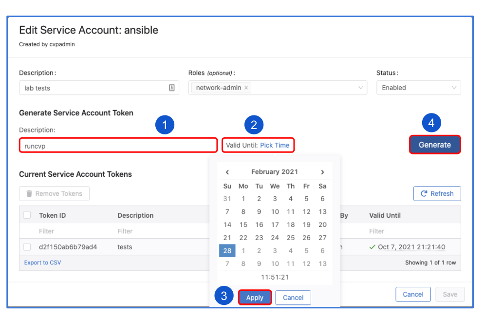

# gRPC python library example

## Install requirements

```shell
pip install -r requirements.txt
```

## Authenticating with CloudVision

### CloudVision On-Prem

The [get_token.py](./get_token.py) script can be used to get the token (expires in 24h) and the certificate from
the CloudVision server:

`python3 get_token.py --server 192.0.2.79 --username cvpadmin --password arista --ssl`

The two files that will be saved can then be used to authenticate:

- token.txt
- cvp.crt

> NOTE: Starting from 2020.3.0 Service Account Token can be used just as on CloudVision as a Service.

> Tip: Service account tokens generated from the UI or via the service account resource APIs is recommended as they can have up to 10 years validity.

### CloudVision as a Service

To access the CloudVision as-a-Service and send API requests, “Service Account Token” is needed.
After obtaining the service account token, it can be used for authentication when sending API requests.

Service accounts can be created from the Settings page where a service token can be generated as seen below:





The token should be copied and saved to a file that can later be referred to.

## Example

```shell
python intf.py --server cvp1:443 \
--token-file token.tok \
--cert-file cvp.crt \
--config-file delta.yaml \
--build-only True \
--wsid 075ff2d7-533d-4bb7-8f25-8a10d30f8982
```

> NOTE the --cert-file flag is only required for self-signed certs and not required for CVaaS or on-prem releases with a signed certificate.
